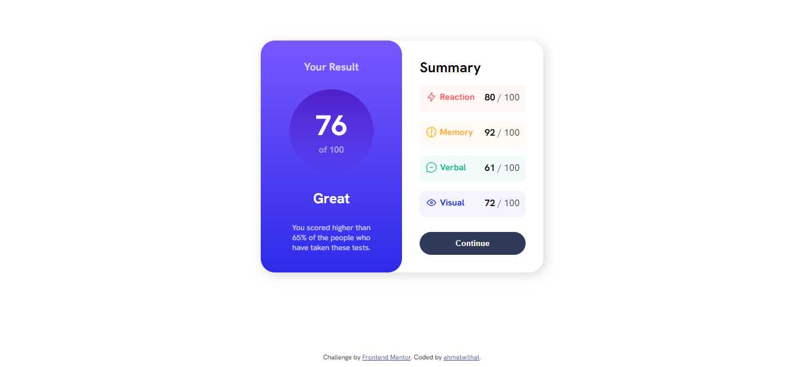
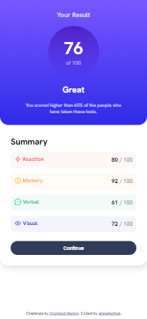

# Frontend Mentor - Results summary component solution

This is a solution to the [Results summary component challenge on Frontend Mentor](https://www.frontendmentor.io/challenges/results-summary-component-CE_K6s0maV). Frontend Mentor challenges help you improve your coding skills by building realistic projects. 

## Table of contents

- [Overview](#overview)
  - [The challenge](#the-challenge)
  - [Screenshot](#screenshot)
  - [Links](#links)
- [My process](#my-process)
  - [Built with](#built-with)
- [Author](#author)
- [Acknowledgments](#acknowledgments)

## Overview

My first FrontendMentor challenge and my first time actually styling something by looking at the design. 

### The challenge

Users should be able to:

- View the optimal layout for the interface depending on their device's screen size
- See hover and focus states for all interactive elements on the page

### Screenshot

### Links

- [Solution](https://ahmetwithat.github.io/results-summary-frontendmasters)

## My process

I don't really know what I am supposed to say here. It was a pretty straight-forward challenge.

### Built with

- Semantic HTML5 markup
- CSS custom properties
- Flexbox
- CSS Grid
- Mobile-first workflow -- not really but the media query is for the desktop so i guess?

## Author

- Website - [ahmetwithat](https://ahmetwithat.github.io)
- Frontend Mentor - [@ahmetwithat](https://www.frontendmentor.io/profile/ahmetwithat)

## Acknowledgments

Kevin Powell is great. Awesome guy. (You can tell I did this without looking at his code by the way the code is poorly written)
